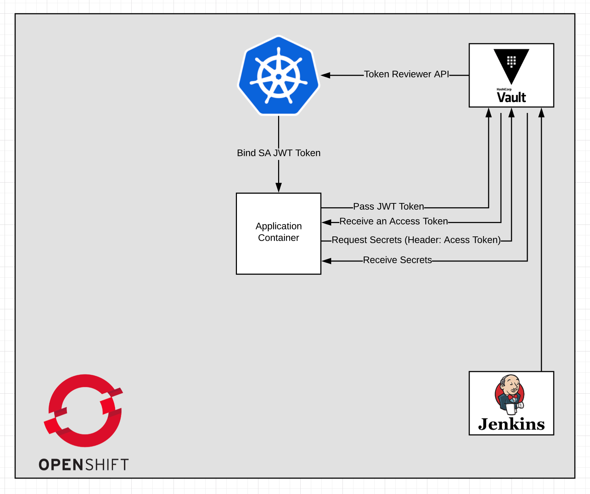

# openshift-vault-secret-management

Openshift is the most advanced container management product as of now which is based on Kubernetes. 
The product is opensource and free to use with a community license. However, the secret management 
in Openshift is a complex problem that is not solved in native Kubernetes and can be solved 
with a third party product such as Hashicorp Vault.

The reason for that is that Kubernetes has Kubernetes secret which is not really a safe place to 
store secrets due to lack of encryption in Kubernetes. Kubernetes secret obfuscates the secrets
using the Base64 hash function. 

Hashicorp Vault is a de facto product designed for secret management. Vault can be integrated with
many different cloud providers and products including Kubernetes which makes it a unique safe secret 
management solution that supports Kubernetes service account to authenticate with Vault. 

In this article, first the installation of Vault in Openshift is described then we show how to integrate
Vault with Kubernetes API to validate service account tokens for authentication with Vault.
Finally, we show how to verify the integration and a simple application is installed in the cluster 
that uses service account to authenticate with Vault and receives secrets from Vault.

## Vault architecture




## Openshift Installation

**Openshift** can be installed by following this document: https://docs.openshift.com/container-platform/4.1/installing/installing_aws/installing-aws-default.html 

The installation is pretty much straightforward and easy to follow. You may need an AWS account, register a 
domain name and install the Openshift using your AWS account credentials.

## Install Hashicorp Vault

Hashicorp suggests installing Vault in Kubernetes(Openshift) using their helm charts. However, before starting
using helm and tiller in Openshift you may need to follow the following steps to enable helm and tiller.

You may need an extra EC2 small instance as a client machine. On the client machine you need to install
- OC CLI compatible with the openshift version: https://docs.openshift.com/container-platform/3.6/cli_reference/get_started_cli.html  
- git: https://git-scm.com/book/en/v2/Getting-Started-Installing-Git
- Helm: https://github.com/helm/helm/blob/master/docs/install.md
- Vault CLI compatible with the Vault server version: https://www.vaultproject.io/downloads.html 

### Login to the Openshift using oc CLI
Now, you need to login to your Openshift server following these steps:
https://docs.openshift.com/container-platform/4.1/installing/installing_aws/installing-aws-default.html 

Now, your client is ready to use for installing Vault server in your Kubernetes cluster. 

### Setup Helm

1- First you need to create a project in Openshift to install tiller:

```
$ oc new-project tiller
 Now using project "tiller" on server "https://...".
 ...
```
 
Setup tiller namespace using the following command:
 
 `$ export TILLER_NAMESPACE=tiller`

2- Install the Helm client locally.

```
$ curl -s https://storage.googleapis.com/kubernetes-helm/helm-v2.9.0-linux-amd64.tar.gz | tar xz
 $ cd linux-amd64
 $ ./helm init --client-only
 ...
 $HELM_HOME has been configured at /.../.helm.
 Not installing Tiller due to 'client-only' flag having been set
 Happy Helming!
```
 
 3- Install tiller server:
 
 `oc process -f https://github.com/openshift/origin/raw/master/examples/helm/tiller-template.yaml -p TILLER_NAMESPACE="${TILLER_NAMESPACE}" -p HELM_VERSION=v2.9.0 | oc create -f -`
 
 Note: make sure you set appropriate tiller/helm version in the command above.
 
 ```
 $ oc rollout status deployment tiller
  Waiting for rollout to finish: 0 of 1 updated replicas are available...
  deployment "tiller" successfully rolled out
```
Get the helm version  

```
   $ ./helm version
   Client: &version.Version{SemVer:"v2.9.0", GitCommit:"f6025bb9ee7daf9fee0026541c90a6f557a3e0bc", GitTreeState:"clean"}
   Server: &version.Version{SemVer:"v2.9.0", GitCommit:"f6025bb9ee7daf9fee0026541c90a6f557a3e0bc", GitTreeState:"clean"}
```
   
 4- Create a separate project where we’ll install a Helm Chart for Vault
 
 `$ oc new-project vault
  Now using project "vault" on server "https://...".
  ...`
 
 5- Grant the Tiller server edit access to the current project
 
 `$ oc policy add-role-to-user edit "system:serviceaccount:${TILLER_NAMESPACE}:tiller"`
 
 6- Add admin policy privilege to the project:
 
 `oc adm policy add-scc-to-user privileged -z vault -n vault` 
 
 7- Install a Helm Chart following this document: https://www.vaultproject.io/docs/platform/k8s/helm.html
 or https://www.hashicorp.com/blog/announcing-the-vault-helm-chart
 
``` 
  $ git clone https://github.com/hashicorp/vault-helm.git
  $ cd vault-helm 
  $ git checkout v0.1.2
  $ helm install --name=vault
```

8- Initialize and Unseal Vault:

- Check the status:

``` 
  # Check status
  $ oc exec -it vault-0 -- vault status
```

- Initialize Vault:

```
# Initialize
$ kubectl exec -it vault-0 -- vault operator init -n 1 -t 1
```

- Unseal Vault:

```
# Unseal vault
$ kubectl exec -it vault-0 -- vault operator unseal <unsealkey>
```

### Vault in HA mode:


In order to enable Vault in HA mode, we need to install consul to store helm data in its persistence layer.
For more info: https://www.vaultproject.io/docs/platform/k8s/helm.html
The following document shows how to install consul by its helm chart: https://github.com/hashicorp/consul-helm
or running the following command:
```
  $ git clone https://github.com/hashicorp/consul-helm
  $ cd consul-helm
  $ helm install ./consul-helm
```

Once the consul is installed we can install vault after changing values.yaml and enable the ha mode to enabled.

9- Create a route to access Vault UI:

```
  $ oc create route passthrough vault-ui --service vault-ui -n vault
```

Now, vault is successfully installed and ready to be integrated with Kubernetes (Openshift).

## Integrating Vault with Openshift

In order to use Kubernetes authentication method implemented by service account tokens, we may need to enable
Kubernetes backend (a.k.a., Kubernetes token review API) with Vault. The following document describes Kubernetes auth
method: https://www.vaultproject.io/docs/auth/kubernetes.html 

In order to enable Openshift auth method using service account we would need to follow these steps:

1- setup Vault client on the jumpbox to point to the Vault server:

`export VAULT_ADDR=http://$Vault_Kubernetes_address`

Or run:

`echo "export VAULT_ADDR=http://vault-vault.apps.vault-cluster.foundation01.com" >> ~/.bash_profile`

2- Integrate vault with kubernetes API:
 
``` 
# create a service account
$ oc create sa vault-auth

# add a cluster admin policy to the service account created above
$ oc adm policy add-cluster-role-to-user system:auth-delegator -z vault-auth

# get token and secret in an environment variable
$ secret=`oc describe sa vault-auth | grep 'Tokens:' | awk '{print $2}'`
$ token=`oc describe secret $secret | grep 'token:' | awk '{print $2}'`
$ pod=`oc get pods | grep vault | awk '{print $1}'`

# Save kubernetes service account certificate in a local file
$ oc exec $pod -- cat /var/run/secrets/kubernetes.io/serviceaccount/ca.crt >> ca.crt
$ export VAULT_TOKEN=$ROOT_TOKEN

# enable kubernetes verification method in vault
$ vault auth enable -tls-skip-verify kubernetes


# Integrate vault with kubernetes token review API 
$ vault write -tls-skip-verify auth/kubernetes/config token_reviewer_jwt=$token kubernetes_host=https://kubernetes.default.svc:443 kubernetes_ca_cert=@ca.crt
rm ca.crt


# Set Vault policy for kubernetes service account:
$ vault write -tls-skip-verify auth/kubernetes/role/demo bound_service_account_names=default bound_service_account_namespaces='*' policies=default ttl=1h 
```

Now, we try to test the service account token to authenticate with Vault:

```
$ secret=`oc describe sa default | grep 'Tokens:' | awk '{print $2}'`
$ token=`oc describe secret $secret | grep 'token:' | awk '{print $2}'`
$ vault write -tls-skip-verify auth/kubernetes/login role=demo jwt=$token
```

## Testing Vault as secret management solution for containers running in openshift

1- Create an app:

```
 path "secret/app1" {
       capabilities = ["read", "list"]
     }
     path "database/creds/app1" {
       capabilities = ["read", "list"]
     }
   EOF
``` 

```
431  vault policy write app1-policy app1-policy.hcl
  432  vault policy read app1-policy
  433  vault secrets enable -path=secret -version=1 kv
  434  vault kv put secret/app1 username=app1 password=supasecr3t
  435  vault read secret/app1
  436  oc new-project vault-demo
  437  oc projects
  438  oc create sa vault-auth
  439  oc adm policy add-cluster-role-to-user   system:auth-delegator system:serviceaccount:vault-demo:vault-auth
  440  oc serviceaccounts get-token vault-auth > reviewer_sa_jwt.txt
  441  ls
  442  cat reviewer_sa_jwt.txt
  443  oc create sa app1
  444  oc create sa app2
  445  oc get sa
  446  vault write "auth/ocp/role/app1-role"   bound_service_account_names="default,app1"   bound_service_account_namespaces="vault-demo"   policies="app1-policy" ttl=1h
  447  vault write "auth/kubernetes/role/app1-role"   bound_service_account_names="default,app1"   bound_service_account_namespaces="vault-demo"   policies="app1-policy" ttl=1h
  448  oc sa get-token app1
  449  vault write "auth/kubernetes/login" role="app1-role" jwt="
450  cat <<EOF > payload.json
  451    { "role":"app1-role", "jwt":"$(oc sa get-token app1)" }
  452  EOF
  453  curl --request POST --data @payload.json    "${VAULT_ADDR}/v1/auth/kubernetes/login"
  454  curl -H "X-Vault-Token: s.sPktWyjIWIaHze5DxWy0bWYy" "${VAULT_ADDR}/v1/secret/app1"
  455  cat <<EOF> deployment.yaml
  456  apiVersion: apps/v1beta1
  457  kind: Deployment
  458  metadata:
  459    name: basic-example
  460    namespace: vault-demo
  461  spec:
  462    replicas: 1
  463    template:
  464      metadata:
  465        labels:
  466          app: basic-example
  467      spec:
  468        serviceAccountName: app1
  469        containers:
  470          - name: app
  471            image: "kawsark/vault-example-init:0.0.7"
  472            imagePullPolicy: Always
  473            env:
  474              - name: VAULT_ADDR
  475                value: "${VAULT_ADDR}"
  476              - name: VAULT_ROLE
  477                value: "app1-role"
  478              - name: SECRET_KEY
  479                value: "secret/app1"
  480              - name: VAULT_LOGIN_PATH
  481                value: "auth/ocp/login"
  482  EOF
  483  ls
  484  oc create -f deployment.yaml
  485  oc get pods
```

